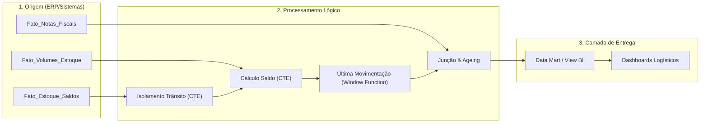

# [Monitoramento de Desembaraço Aduaneiro e Ageing de Materiais em Trânsito]

## 📌 O Desafio de Negócio (Contexto)
Na operação de comércio exterior e suprimentos, o registro da Nota Fiscal (NF) de importação ocorre *antes* da chegada física do material na empresa. Durante esse hiato logístico, o material repousa em um "Depósito Transitório". A dor do negócio consistia no risco de transferir materiais para o depósito físico sem a devida documentação de desembaraço aduaneiro aprovada. A falta de visibilidade temporal sobre quais cargas estavam retidas no trânsito gerava gargalos e atrasos no processo de manufatura e armazenamento final.

## 🎯 O Objetivo
* Criar um pipeline de monitoramento contínuo dos materiais em situação transitória.
* Classificar automaticamente a criticidade da carga com base em regras de *Ageing* (Normal, Atenção e Atrasado).
* Garantir que as equipes de importação/logística exijam as documentações necessárias de forma proativa.
* Prover dados limpos e modelados para consumo dinâmico na camada de Business Intelligence (BI).

## 📐 Arquitetura do Fluxo de Dados

🛠️ A Solução Técnica
Para consolidar os dados do ERP de forma resiliente e performática, as seguintes técnicas SQL foram aplicadas:

Modularização via CTEs: Separação das regras de negócio (cálculo de volumes, rastreio de trânsito e leitura de notas) em blocos independentes e de fácil manutenção.

Window Functions (ROW_NUMBER): Utilizada para isolar eficientemente o evento de movimentação mais recente de cada código de barras, eliminando a necessidade de Sub-Queries correlacionadas pesadas no banco de dados.

Mapeamento Condicional: Regras de negócio como cálculo do saldo residual do volume (NVL) e categorização do tempo de espera (CASE WHEN com cálculo de SYSDATE) foram resolvidas diretamente na camada analítica.

🚀 Impacto Esperado (ou Real)
Redução de Riscos de Compliance: Bloqueio operacional preventivo, garantindo que nenhum item avance fisicamente sem o desembaraço documental.

Aumento na Eficiência das Equipes de Comex: Mudança de um processo reativo (descobrir o problema na portaria/depósito) para proativo (alertas automatizados na camada de "Atenção" ou "Atrasado").

Governança de Dados Otimizada: Entrega de um dataset sumarizado que é consumido em tempo de execução pelas ferramentas de BI, diminuindo a carga e o processamento desnecessário no banco de dados do ERP.
